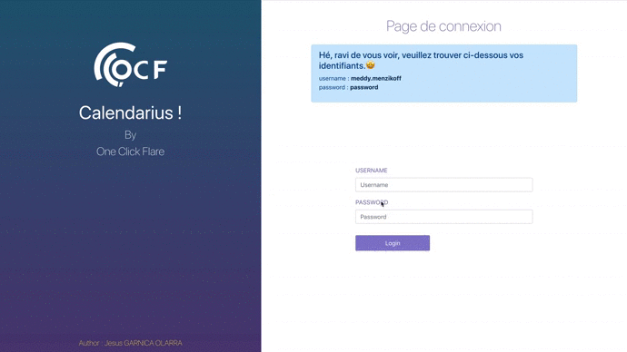

# Calendarious@App

           

Web Application to manage meetings. The web interface allows you to **C**reat, **R**ead, **U**pdate and **D**elete appoiments from your Agenda. Otherwise you must first authenticate to access this page.

This Application use a session cookie to persist connection  between client and server even after the user has closed the **window** into an web explorer. This way the meetings created on your Agenda will persist in the browser until the window is closed or server is stop.

## Demo



## Development

The developpment tasks can be splitted into Functional and Thecnical Assigments.

**Funtional Assigments:**

:small_blue_diamond: Navigation throught the App, Redirection to Login if not Authenticated, Redirection to Managment Page if Authenticated.

:small_blue_diamond: Creation, Reading, Updating, Deleting, of Meeting.

:small_blue_diamond:  Application Login and Logout and Error Displaying in case of Failed Login.

:small_blue_diamond: Goog User Interface Design an User Experience

**Thecnical Assigments:**

:small_orange_diamond: Clean code

:small_orange_diamond: Code documentation

:small_orange_diamond: CSS Style

:small_orange_diamond: Splitting an application into separate layers (ui, state, service and application).

:small_orange_diamond: **Session and State persistence**  (No Database implementation Request)

:small_orange_diamond: **REST API** with Security in Routes

:small_orange_diamond: *WEB App dockerization*

## Running Application 🖥️ (The asiest way 😊)

Once you've cloned the project to your machine you can launch the project. Easy! 👏🏻

1. Navigate to the directory in which you cloned the project.


   ```
   cd calendarious-app
   ```

2. Run the following commands from this directory


   ```
   docker-compose up
   ```

The docker-compose command will build images and run Docker containers. It will  link the client and the server based on the information inside the docker-compose.yml file. This will also create ports, and configure applications as requrired. **After a few minutes** the command completes and the application will be available.

3. Acces Aplication

   [http://localhost:3000](http://localhost:3000/) (Calendarious Client)

   [http://localhost:8081](http://localhost:8081/) (Calendarious Server)

4. Stop Application


   ```
   docker-compose stop
   ```


## Doubts? Ideas? Corrections?

Send an Issue, a pull request or knock me in my **<u>Live Chat</u>** at  https://jesus-garnica-olarra.herokuapp.com/ 
